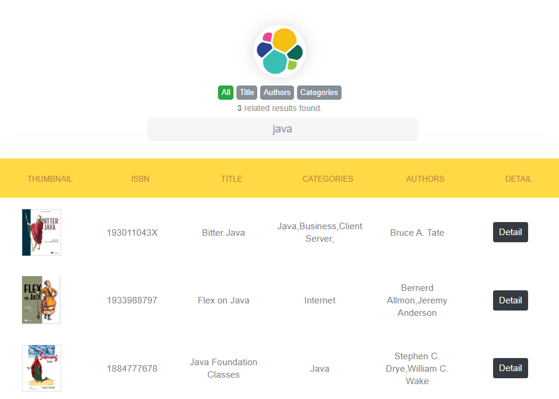
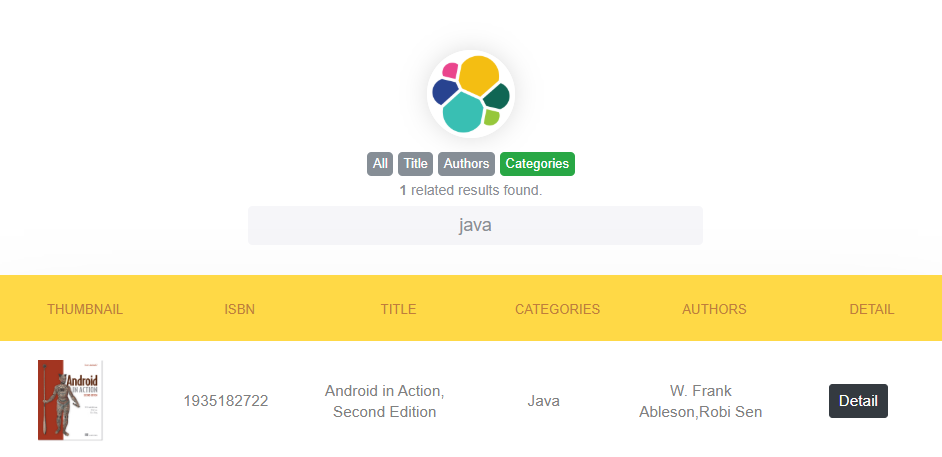

# php-elasticsearch-client
In this example, **adapter pattern** is implemented with php and elasticsearch. For example, the book data in the books.json was used.

Firstly must install elasticsearch. [Click](https://www.elastic.co/guide/en/apm/get-started/current/install-elasticsearch.html) for installation steps.

> composer install

